# DATA_WORKFLOW.md — RevengersHack Firestore Canonical Reference

> **Status:** Produced via code audit on 2026-07-05.
> **Rule:** Every Firestore structure change must update this file in the same commit.
> **Source of truth:** Code is authoritative; this doc reflects the code as it actually runs, not design intentions.

| Conflict | Status | Resolved |
|---|---|---|
| #1 Team name bug | 🟡 PENDING CONFIRMATION | Batch 2 |
| #2 member invitedTeamId synthetic string | 🟡 PENDING CONFIRMATION | Batch 5 |
| #3 importedAt vs invitedAt | ✅ RESOLVED 2026-07-05 | SCHEMA.md updated |
| #4 emailLogs field shape | ✅ RESOLVED 2026-07-05 | SCHEMA.md updated |
| #5 Security rule escalation | 🟡 PENDING CONFIRMATION | Batch 4 |
| #6 joinGangLeads unread | 🟡 PENDING CONFIRMATION | Batch 3c |
| #7 rounds missing title | 🟡 PENDING CONFIRMATION | Batch 3a |
| #8 needChangesHistory field names | ✅ RESOLVED 2026-07-05 | SCHEMA.md updated |
| #9 member notifications skipped | 🟡 PENDING CONFIRMATION | Batch 3b |

---

## STEP 1 — COLLECTION INVENTORY (AS-IS)

---

### `invitedTeams`

**Purpose:** The access-gating whitelist. One doc per shortlisted team. Admin-created via CSV import.
**Document ID:** Auto-generated

| Field | Type | Notes |
|---|---|---|
| `teamName` | string | |
| `leaderName` | string | |
| `leaderEmail` | string | Normalized to lowercase. The gate key. |
| `leaderPhone` | string | |
| `college` | string | |
| `status` | string enum | `'Invited' -> 'EmailSent'/'EmailFailed' -> 'Verified' -> 'Submitted' -> 'Approved'/'Rejected'/'Incomplete'` |
| `importBatchId` | string | UUID from CSV import session |
| `importedAt` | Timestamp | Written by invitation.service.ts |
| `updatedAt` | Timestamp | Written by team.service.ts and admin.service.ts on status changes |

> [!WARNING]
> **DISCREPANCY:** SCHEMA.md specifies `invitedAt` + `emailSentAt` + `verifiedAt`. The actual invitation.service.ts writes **`importedAt`** (not `invitedAt`). `emailSentAt` and `verifiedAt` are written by auth.service.ts only. The SCHEMA.md field names do not match reality.

> [!WARNING]
> **DISCREPANCY:** SCHEMA.md specifies fields `city`, `state`, `round` — none of these are written by `invitation.service.ts` (CsvRow interface has no city/state/round). These fields are never populated.

**Written by:** `POST /api/admin/import-csv` -> `invitation.service.ts:importInvitations()`
**Updated by:** `auth.service.ts:verifyOtpAndCreateSession()` (-> Verified), `team.service.ts:submitTeamProfile()` (-> Submitted), `admin.service.ts:reviewTeam()` (-> Approved/Rejected/Incomplete)
**Read by:** `auth.service.ts:checkInviteStatus()`, `auth.service.ts:verifyOtpAndCreateSession()`
**References:** None (source, not referencing)
**Referenced by:** `users.invitedTeamId` -> invitedTeams doc ID, `teams.invitedTeamId` -> invitedTeams doc ID

---

### `users`

**Purpose:** One doc per authenticated platform user. Document ID = Firebase Auth UID.
**Document ID:** Firebase Auth UID

| Field | Type | Notes |
|---|---|---|
| `uid` | string | Mirrors the doc ID |
| `email` | string | Lowercase |
| `role` | string enum | `'participant_leader' or 'participant_member' or 'admin' or 'super_admin'` |
| `teamId` | string or null | FK -> teams doc ID; null until team is submitted |
| `invitedTeamId` | string or null | FK -> invitedTeams doc ID; null for admins; synthetic `member-{teamId}-{email}` string for members |
| `displayName` | string or null | Not collected in current onboarding flow; always null |
| `createdAt` | Timestamp | |
| `updatedAt` | Timestamp | |
| `lastLoginAt` | Timestamp or null | |
| `isActive` | boolean | false = soft-banned |

> [!WARNING]
> **DISCREPANCY:** For `participant_member` logins, `invitedTeamId` is set to a **synthetic string** `"member-{teamId}-{email}"` — this is NOT a valid Firestore document ID. It is a fabricated string. Any code that tries to look up `invitedTeams.doc(user.invitedTeamId)` for a member will silently fail.

**Written by:**
- Created: `auth.service.ts:verifyOtpAndCreateSession()` (first login)
- Updated: `auth.service.ts` (lastLoginAt on every login), `team.service.ts:submitTeamProfile()` (teamId updated), `make-admin.js` (role set directly via Admin SDK)

**Read by:** `admin.service.ts:reviewTeam()`, `ticket.service.ts`, `auth.service.ts` (role check bypass), `notification.service.ts`
**References:** `teamId` -> teams, `invitedTeamId` -> invitedTeams (with caveat above)
**Security rule:** Users can read their own doc. Writes: `allow write: if isAdminOrSuperAdmin()` — see **CONFLICT #5** below.

---

### `otpCodes`

**Purpose:** Server-only OTP storage (hashed). Never readable by client.
**Document ID:** Auto-generated

| Field | Type | Notes |
|---|---|---|
| `email` | string | Lowercase |
| `codeHash` | string | SHA-256 hash of `otp:pepper` |
| `expiresAt` | Date (stored as Timestamp) | 10 min from issuance |
| `attempts` | number | Incremented on each failed verify |
| `used` | boolean | true once successfully verified |
| `createdAt` | Timestamp | |

> [!WARNING]
> **DISCREPANCY:** SCHEMA.md names the hash field `code`. The actual code writes it as **`codeHash`**. The schema is wrong.

> [!NOTE]
> `expiresAt` is written as a JS `Date` object, not a `Timestamp`. Firestore auto-converts it. The read path handles both types correctly.

**Written by:** `auth.service.ts:generateAndStoreOtp()`
**Updated by:** `auth.service.ts:verifyOtpAndCreateSession()` (marks `used: true`, increments `attempts`)
**Read by:** `auth.service.ts:verifyOtpAndCreateSession()` (full collection scan filtered in-memory)
**Security rule:** `allow read, write: if false` — Admin SDK only

---

### `otpRateLimits`

**Purpose:** Server-only rate limiting. One doc per email.
**Document ID:** `encodeURIComponent(email)` — URL-encoded email

| Field | Type | Notes |
|---|---|---|
| `email` | string | Lowercase |
| `count` | number | Requests in current window |
| `windowStart` | Timestamp | Rolling 1-hour window start |
| `lastRequest` | Timestamp | |

**Written/Updated by:** `auth.service.ts:checkAndIncrementRateLimit()` (inside Firestore transaction)
**Read by:** Same function
**Security rule:** `allow read, write: if false` — Admin SDK only

---

### `teams`

**Purpose:** One doc per team. Created when team leader submits the team profile form.
**Document ID:** Auto-generated

| Field | Type | Notes |
|---|---|---|
| `teamName` | string | |
| `college` | string | |
| `leaderId` | string | FK -> users.uid |
| `invitedTeamId` | string | FK -> invitedTeams doc ID |
| `members` | array of objects | Each: `{ name, email, phone, role }` |
| `memberEmails` | array of strings | Flat lowercase email list — added for `array-contains` queries |
| `status` | string enum | `'Submitted' or 'Approved' or 'Rejected' or 'Incomplete'` |
| `createdAt` | Timestamp | First submission only |
| `updatedAt` | Timestamp | Every update |
| `needChangesHistory` | array | Objects: `{ notes, timestamp (ISO string), reviewedBy }` |

> [!WARNING]
> **DISCREPANCY vs SCHEMA.md:** The actually-written `members` objects contain `{ name, email, phone, role }`. SCHEMA.md specifies `uid`, `college`, `github`, `linkedin`, `joinedAt`, `removedAt` — **none of these are written by the current code**.

> [!WARNING]
> **BUG:** `admin.service.ts:reviewTeam()` reads `teamData['name']` (line 47) to get the team name for notifications — but the field is actually stored as `teamName`. This means the team name in approval/rejection/needChanges emails is always `'Hacker'`.

> [!NOTE]
> `needChangesHistory` entries use `{ notes, timestamp (ISO string), reviewedBy }` — SCHEMA.md says `{ note, at (Timestamp), byAdminUid }`. Different field names.

**Written by:** `POST /api/team/submit` -> `team.service.ts:submitTeamProfile()`
**Updated by:** `POST /api/team/update` -> `team.service.ts:updateTeamDetails()`, `POST /api/admin/review-team` -> `admin.service.ts:reviewTeam()`, `migrate-member-emails.js` (backfill script)
**Read by:** `submission.service.ts`, `notification.service.ts:createTeamNotification()`, `auth.service.ts` (member login check)
**References:** `leaderId` -> users, `invitedTeamId` -> invitedTeams
**Back-referenced by:** `users.teamId`, `submissions.teamId`

---

### `submissions`

**Purpose:** One doc per team per round submission.
**Document ID:** Composite `{teamId}_{roundId}` — deterministic, allows upsert

| Field | Type | Notes |
|---|---|---|
| `teamId` | string | FK -> teams |
| `roundId` | string | FK -> rounds |
| `githubLink` | string | Note: SCHEMA says `githubUrl` |
| `demoLink` | string or null | Note: SCHEMA says `demoUrl` |
| `submittedBy` | string | FK -> users.uid |
| `status` | string | `'Submitted'` (only value written currently) |
| `submittedAt` | Timestamp | |

> [!WARNING]
> **DISCREPANCY vs SCHEMA.md:** SCHEMA specifies `githubUrl`, `demoUrl`, `pptUrl`, `videoUrl`, `docsUrl`, `notes`, `scores[]`, `lockedAt`, `updatedAt`. The actual code writes **`githubLink`** and **`demoLink`** only. SCHEMA field names differ from actual code.

**Written by:** `POST /api/submission/submit` -> `submission.service.ts:submitPayload()`
**Read by:** `submission.service.ts` (team/round validation), frontend via Firestore rules
**References:** `teamId` -> teams, `roundId` -> rounds, `submittedBy` -> users
**Security rule:** Participants read own team submissions only; no client writes

---

### `rounds`

**Purpose:** Controls the active hackathon round and submission deadlines. Fixed document IDs.
**Document ID:** `round-1`, `round-2`, `round-3` (hardcoded)

| Field | Type | Source |
|---|---|---|
| `isActive` | boolean | Written by `activateRound()` |
| `updatedAt` | Timestamp | Written by `activateRound()` |
| `title` | string | Written by dev/seed route ONLY — NOT by `activateRound()` |
| `description` | string | Written by dev/seed route ONLY |
| `submissionDeadline` | Timestamp or null | Must be set manually in Firestore console |

> [!NOTE]
> **NOT dead.** `rounds` is actively read by: `submission.service.ts` (validates `isActive` + deadline before accepting a submission), `dashboard.js` (real-time listener for participants), and `admin.js` (round activation dropdown).

> [!NOTE]
> **NOT a duplicate** of any other collection. Controls event phase/timeline, not access gating.

> [!WARNING]
> **ISSUE:** `activateRound()` does NOT write `title` or `description` — only `isActive`. If the dev/seed script was never run in production, round docs have no `title` field, breaking the admin UI dropdown.

**Written by:** `POST /api/admin/activate-round` -> `admin.service.ts:activateRound()` (isActive only), `POST /api/dev/seed` (full doc)
**Read by:** `submission.service.ts`, dashboard.js, admin.js
**Security rule:** Authenticated users can read; `write: if false` (Admin SDK only)

---

### `announcements`

**Purpose:** Admin broadcast messages to all participants.
**Document ID:** Auto-generated

| Field | Type | Notes |
|---|---|---|
| `title` | string | |
| `message` | string | |
| `timestamp` | Timestamp | Note: SCHEMA says `createdAt` |
| `createdBy` | string | Admin UID |
| `updatedBy` | string or null | |
| `updatedAt` | Timestamp or null | |
| `isVisible` | boolean | Soft-delete flag |
| `version` | number | Incremented on edit |

> [!WARNING]
> **DISCREPANCY:** SCHEMA.md says the creation timestamp field is `createdAt`. The actual code writes **`timestamp`**. Any frontend sorting by `createdAt` will fail silently.

**Subcollection `ReadState/{userId}`:** `{ readAt: Timestamp }` — client-writable (own doc only)

**Written by:** `POST /api/admin/announcement` -> `admin.service.ts:createAnnouncement()`
**Updated by:** `PUT /api/admin/announcement/[id]`, `DELETE` -> soft delete
**Read by:** Frontend (dashboard.js, admin.js)

---

### `notifications`

**Purpose:** In-app notifications per user.
**Document ID:** Auto-generated

| Field | Type | Notes |
|---|---|---|
| `userId` | string | FK -> users.uid |
| `type` | string | `'system_alert', 'team_approved', 'team_rejected', 'team_need_changes', 'submission_received', 'support_reply'` |
| `title` | string | |
| `message` | string | Note: SCHEMA says `body` |
| `actionLink` | string or null | |
| `isRead` | boolean | |
| `createdAt` | Timestamp | |

> [!WARNING]
> **DISCREPANCY:** SCHEMA.md specifies `body`, `refId`, `refType`, `readAt`. The actual code writes **`message`** (not `body`) and does not write `refId`, `refType`, or `readAt`.

> [!IMPORTANT]
> **MEMBER NOTIFICATIONS SILENTLY SKIPPED:** `notification.service.ts:createTeamNotification()` only notifies the leader (leaderId). Members are explicitly skipped because the `members[]` array doesn't store UIDs. See CONFLICT #9.

**Written by:** `admin.service.ts:reviewTeam()`, `submission.service.ts:submitPayload()`, `ticket.service.ts:adminReplyTicket()`
**Read by:** Frontend — participants read own, can mark `isRead` via client SDK
**Security rule:** Read/update own doc. No client create/delete

---

### `AuditLogs`

**Purpose:** Immutable append-only log of all admin/privileged actions.
**Document ID:** Auto-generated
**Collection name:** `AuditLogs` (capital A — inconsistent with other camelCase collection names)

| Field | Type | Notes |
|---|---|---|
| `action` | string | AuditAction enum value |
| `actorUid` | string | |
| `actorRole` | string | |
| `targetId` | string or null | |
| `targetType` | string or null | |
| `metadata` | object | |
| `ip` | string or null | Always `null` — IP never passed from API routes |
| `at` | Timestamp | |

**Written by:** Every service via `audit.service.ts:writeAuditLog()`
**Read by:** Admin frontend (admin.js)
**Security rule:** Admin/super_admin read only; `write: if false`

---

### `emailLogs`

**Purpose:** Record of every email send attempt.
**Document ID:** Auto-generated

| Field | Type | Notes |
|---|---|---|
| `to` | string | Email address — Note: SCHEMA says `recipient` |
| `template` | string | Template name |
| `success` | boolean | Note: SCHEMA says `status: 'Sent'/'Failed'/'Bounced'` |
| `error` | string or null | |
| `messageId` | string or null | Provider message ID |
| `timestamp` | Timestamp | Note: SCHEMA says `sentAt` |

> [!WARNING]
> **DISCREPANCY vs SCHEMA.md:** SCHEMA specifies `{ recipient, status, provider, retries, sentAt, failedAt }`. Actual code writes `{ to, success, error, messageId, timestamp }`. Completely different shape.

**Written by:** `email.service.ts:logEmailAttempt()` — called after every send attempt
**Read by:** Admin frontend only
**Security rule:** Admin/super_admin read only; `write: if false`

---

### `tickets`

**Purpose:** Support tickets from participants to admins.
**Document ID:** Auto-generated

| Field | Type | Notes |
|---|---|---|
| `userId` | string | FK -> users.uid |
| `teamId` | string or null | FK -> teams |
| `subject` | string | |
| `category` | string | `'Technical', 'Submission', 'General'` |
| `status` | string | `'Open', 'Pending', 'Resolved'` |
| `messages` | array | Embedded: `[{ sender, senderUid, senderName, content, timestamp (ISO string) }]` |
| `createdAt` | Timestamp | |
| `updatedAt` | Timestamp | |

> [!WARNING]
> **NOTE:** Messages are stored as an **embedded array**, not a subcollection as SCHEMA.md specifies. This will hit Firestore's 1MB document limit for high-volume tickets. Workable at current scale.

**Written by:** `POST /api/tickets` -> `ticket.service.ts:createTicket()`
**Updated by:** `POST /api/admin/tickets/[id]/reply` -> `ticket.service.ts:adminReplyTicket()`
**Read by:** `GET /api/tickets` (user's own), admin frontend
**Security rule:** `read: if own OR isAdmin`. `write: if false` (all via Admin SDK)

---

### `joinGangLeads` — FLAGGED

**Purpose:** Landing-page interest form submissions. Collects name/email/phone/teamName from visitors BEFORE the hackathon starts.
**Document ID:** Auto-generated
**Written by:** `frontend/js/firebase-join.js` — **direct client SDK write** (no backend API route)

| Field | Type | Notes |
|---|---|---|
| `name` | string | |
| `email` | string | |
| `number` | string | Phone number |
| `teamName` | string | |
| `source` | string | `"landing-page"` |
| `createdAt` | Timestamp | |

> [!NOTE]
> **NOT a duplicate of `invitedTeams`.** These are sequential in the pipeline: `joinGangLeads` = public interest form (anyone can submit, pre-selection), `invitedTeams` = confirmed post-selection invites (admin-created only).

> [!IMPORTANT]
> **NOT in the backend spec at all.** `joinGangLeads` is a pure frontend/Vite-era collection written directly via client SDK. No backend API route or service file reads it. Admins must use the Firestore console directly to view leads. Also NOT in SCHEMA.md.

---

---

## STEP 2 — CANONICAL WORKFLOW DIAGRAM

```mermaid
flowchart TD
    A["Visitor submits Join Gang form on landing page"]
    B["joinGangLeads doc created\nclient SDK, anonymous auth\nFields: name, email, number, teamName, source, createdAt"]
    C["Admin reviews leads in Firestore console only\nNo backend route reads joinGangLeads"]
    D["Admin uploads CSV of shortlisted teams\nPOST /api/admin/import-csv"]
    E["invitedTeams doc created\nstatus: Invited\nFields: teamName, leaderName, leaderEmail,\nleaderPhone, college, importBatchId, importedAt"]
    F["invitation email sent\ntemplate: invitation\nemailLogs doc created"]
    G["Leader enters email on login page\nPOST /api/auth/request-otp"]
    H{"checkInviteStatus\nEmail in invitedTeams?\nOR admin role in users?\nOR email in teams.memberEmails where status=Approved?"}
    I["OTP generated + hashed\notpCodes doc created\notpRateLimits doc updated"]
    J["Leader enters OTP\nPOST /api/auth/verify-otp"]
    K["OTP validated\ninvitedTeams.status -> Verified\nFirebase Auth user created\nusers doc created:\n  role: participant_leader\n  teamId: null\n  invitedTeamId: real invitedTeams ID\ncustomToken issued\nAuditLogs entry written"]
    L["Leader submits team profile form\nPOST /api/team/submit"]
    M["teams doc created:\n  leaderId -> users.uid\n  invitedTeamId -> invitedTeams ID\n  members array with no UIDs\n  memberEmails flat email list\n  status: Submitted\nusers.teamId -> teams doc ID\ninvitedTeams.status -> Submitted\nAuditLogs entry written"]
    N["Admin opens cmd-center.html\nReads teams where status=Submitted\nPOST /api/admin/review-team"]
    O1["Approve\nteams.status -> Approved\ninvitedTeams.status -> Approved\nnotifications doc -> leader ONLY\nemailLogs doc created\nAuditLogs entry written"]
    O2["Reject\nteams.status -> Rejected\ninvitedTeams.status -> Rejected\nnotifications doc -> leader ONLY\nemailLogs doc created\nAuditLogs entry written"]
    O3["NeedChanges\nteams.status -> Incomplete\nteams.needChangesHistory appended\ninvitedTeams.status -> Incomplete\nnotifications doc -> leader ONLY\nemailLogs doc created\nAuditLogs entry written"]
    P["Leader fixes and resubmits\nPOST /api/team/update\nteams.status -> Submitted again\nback to admin review queue"]
    Q["Team member opens login page\nEnters their email\nPOST /api/auth/request-otp"]
    R["checkInviteStatus:\nNOT in invitedTeams\ncheck teams.memberEmails array-contains\nfound in Approved team\nreturns synthetic member-teamId-email ID"]
    S["Member OTP verified\nusers doc created:\n  role: participant_member\n  teamId -> teams doc ID\n  invitedTeamId: synthetic string NOT a real FK\nNO invitedTeams status update\ncustomToken issued"]
    T["Admin activates a round\nPOST /api/admin/activate-round\nrounds: one isActive=true, rest false\nAuditLogs entry written"]
    U["Leader submits project\nPOST /api/submission/submit"]
    V["rounds doc checked: isActive + submissionDeadline\nsubmissions doc upserted ID is teamId_roundId\n  githubLink, demoLink, submittedBy, status: Submitted\nnotifications doc -> leader\nAuditLogs entry written"]
    W["Leader/member raises support ticket\nPOST /api/tickets\ntickets doc created messages embedded array"]
    X["Admin replies\nPOST /api/admin/tickets/id/reply\ntickets.messages appended\ntickets.status -> Pending\nnotifications doc -> user"]

    A --> B --> C --> D --> E --> F
    F --> G --> H
    H -->|"Not found"| REJECT["Throws NOT_INVITED error"]
    H -->|"Found"| I --> J --> K --> L --> M --> N
    N --> O1
    N --> O2
    N --> O3 --> P --> N
    O1 --> Q --> R --> I
    R --> S
    O1 --> T --> U --> V
    V --> W --> X
```



### Actual vs Intended Discrepancies in the Flow

| Step | What code actually does | What SCHEMA.md says |
|---|---|---|
| Leader login: users doc | `invitedTeamId` = real invitedTeams doc ID | Same |
| Member login: users doc | `invitedTeamId` = synthetic `"member-{teamId}-{email}"` string | Not specified in spec |
| Team submission fields | writes `{ teamName, college, leaderId, members[], memberEmails[] }` | SCHEMA specifies 20+ fields incl. leader contact, department, year, state, city |
| Team name in review emails | reads `teamData['name']` which does not exist | Should read `teamData['teamName']` |
| Announcement creation timestamp | written as `timestamp` | SCHEMA says `createdAt` |
| emailLogs shape | `{ to, success, error, messageId, timestamp }` | SCHEMA says `{ recipient, status, provider, retries, sentAt }` |
| submissions field names | `githubLink`, `demoLink` | SCHEMA says `githubUrl`, `demoUrl` |
| AuditLogs.ip | always `null` | Should be caller IP |

---

## STEP 3 — CONFLICT LIST

---

**CONFLICT #1 — BUG: Team name always shows as "Hacker" in review emails**
- **File:** [admin.service.ts](file:///Users/havocerebus/Documents/Documents%20/Current_Project_Working/1sthackathon/backend-nextjs/server/services/admin.service.ts#L47-L47) line 47
- **Problem:** `teamData['name']` is read but the field is stored as `teamData['teamName']`. All approval/rejection/needChanges emails address the team as "Hacker".
- **Proposed fix:** Change `teamData['name']` to `teamData['teamName']` in `reviewTeam()`.
- **Risk:** Low — pure read fix, zero data change.

---

**CONFLICT #2 — DATA INTEGRITY: `invitedTeamId` on member users is a non-resolvable synthetic string**
- **File:** [auth.service.ts](file:///Users/havocerebus/Documents/Documents%20/Current_Project_Working/1sthackathon/backend-nextjs/server/services/auth.service.ts#L302-L302) lines 302, 407
- **Problem:** Members get `invitedTeamId = "member-{teamId}-{email}"` — this is NOT a valid Firestore document ID. Any code doing `invitedTeams.doc(user.invitedTeamId)` on a member user will silently reference a non-existent document.
- **Proposed fix:** Set `invitedTeamId: null` for `participant_member` users. Their team affiliation is already captured by `teamId`.
- **Risk:** Medium — requires a one-time data migration on any existing member user docs.

---

**CONFLICT #3 — SCHEMA DRIFT: `invitedTeams.importedAt` vs SCHEMA's `invitedAt`**
- **File:** [invitation.service.ts](file:///Users/havocerebus/Documents/Documents%20/Current_Project_Working/1sthackathon/backend-nextjs/server/services/invitation.service.ts#L93-L93) line 93
- **Problem:** Code writes `importedAt`; SCHEMA.md says `invitedAt`. Minor but causes documentation confusion.
- **Proposed fix:** Update SCHEMA.md to say `importedAt` — do NOT change the code. Live data already uses `importedAt`.
- **Risk:** Zero — doc-only change.

---

**CONFLICT #4 — SCHEMA DRIFT: `emailLogs` field names differ entirely**
- **File:** [email.service.ts](file:///Users/havocerebus/Documents/Documents%20/Current_Project_Working/1sthackathon/backend-nextjs/server/services/email.service.ts#L498-L504) lines 498-504
- **Problem:** SCHEMA describes `{ recipient, status, provider, retries, sentAt }`. Code writes `{ to, success, error, messageId, timestamp }`. Anyone querying by SCHEMA fields will get empty results.
- **Proposed fix:** Update SCHEMA.md to document the actual fields. Data in production uses the code's shape.
- **Risk:** Zero — doc-only change.

---

**CONFLICT #5 — SECURITY: Firestore rules allow any admin to self-escalate to super_admin via client SDK**
- **File:** [firestore.rules](file:///Users/havocerebus/Documents/Documents%20/Current_Project_Working/1sthackathon/firestore.rules#L30-L30) line 30
- **Problem:** `allow write: if isAdminOrSuperAdmin()` means a plain `admin` authenticated via client SDK can write `users/{anyUid}` — including setting `role: 'super_admin'` on themselves.
- **Proposed fix:** Change the `users` write rule to `allow write: if false`. All current user mutations already go through Admin SDK API routes. No legitimate client code writes to `users` directly.
- **Risk:** Medium — verify no client code legitimately writes to `users` before deploying.

---

**CONFLICT #6 — DEAD WORKFLOW: `joinGangLeads` is written but never read by any backend**
- **Problem:** The collection has live data but no API route reads it. No admin portal surface exists. Organizers must use the Firestore console directly.
- **Proposed fix (Option A — minimal):** Add `joinGangLeads` count to the admin analytics endpoint.
- **Proposed fix (Option B — proper):** Add a "View Leads" section to the admin portal listing leads with one-click promote-to-invite flow.
- **Risk:** Low — additive only, no data at risk.

---

**CONFLICT #7 — MISSING DATA: `rounds` docs have no `title`/`description` unless seed was run**
- **File:** [admin.service.ts](file:///Users/havocerebus/Documents/Documents%20/Current_Project_Working/1sthackathon/backend-nextjs/server/services/admin.service.ts#L160-L163) lines 160-163
- **Problem:** `activateRound()` only writes `isActive` + `updatedAt`. If the dev/seed script was never run in production, round docs have no `title` field, breaking the admin UI dropdown display.
- **Proposed fix:** Accept `title` and `description` params in `activateRound()` and write them with the same `merge: true` call.
- **Risk:** Low — additive field write.

---

**CONFLICT #8 — SCHEMA DRIFT: `teams.needChangesHistory` field names differ**
- **File:** [admin.service.ts](file:///Users/havocerebus/Documents/Documents%20/Current_Project_Working/1sthackathon/backend-nextjs/server/services/admin.service.ts#L79-L83) lines 79-83
- **Problem:** Code writes `{ notes, timestamp (ISO string), reviewedBy }`. SCHEMA.md says `{ note, at (Timestamp), byAdminUid }`.
- **Proposed fix:** Update SCHEMA.md to match actual code shape.
- **Risk:** Zero — doc-only change.

---

**CONFLICT #9 — UX GAP: Team member notifications are silently skipped**
- **File:** [notification.service.ts](file:///Users/havocerebus/Documents/Documents%20/Current_Project_Working/1sthackathon/backend-nextjs/server/services/notification.service.ts#L83-L87) lines 83-87
- **Problem:** `createTeamNotification()` only notifies the leader. Members are deliberately skipped because the `members[]` array doesn't store UIDs. When a team gets approved/rejected, only the leader is informed.
- **Proposed fix:** Now that members can log in and get `users` docs (with `teamId` set), query `users` where `teamId == teamId` and send notifications to all. Do not rely on the embedded `members[]` array for UIDs.
- **Risk:** Low — additive, no existing behavior broken.

---

## STEP 4 — ADMIN PROVISIONING PLAN

### Current State (Problems)

- Admin accounts created manually via `make-admin.js` (local script, hardcoded email, no audit trail)
- No restriction preventing plain `admin` from escalating themselves to `super_admin` via client SDK (Conflict #5)
- `make-admin.js` must be edited by hand for each new admin — not scalable

### Proposed System (6 Components)

#### A. Close the Privilege Escalation Gap First (firestore.rules)

Change `users` collection write rule:
```diff
- allow write: if isAdminOrSuperAdmin();
+ allow write: if false;  // All writes via Admin SDK only
```
This is the highest-priority item. All current user mutations already use Admin SDK.

---

#### B. New Route: `POST /api/admin/create-admin`

- Verify caller's ID token via Admin SDK
- Read caller's `users` doc server-side — reject if `role !== 'super_admin'`
- Body: `{ email: string, displayName?: string }`
- Logic: get-or-create Firebase Auth user, upsert `users` doc with `role: 'admin'`
- Write AuditLogs: `action: 'admin.created'`, actorUid, targetId, metadata: `{ email }`
- Return `{ uid, email, created: boolean }`

---

#### C. New Route: `POST /api/admin/promote-admin`

- Same `super_admin` caller check
- Body: `{ targetUid: string, newRole: 'admin' | 'super_admin' }`
- Guard 1: Cannot promote to `super_admin` unless caller is `super_admin`
- Guard 2: Cannot modify another `super_admin`'s role
- Guard 3: Cannot modify your own role (`targetUid !== callerUid`)
- Write AuditLogs: `action: 'admin.role_changed'`

---

#### D. Admin Portal Page: Manage Admins (super_admin only)

- Lists all `users` where role is `admin` or `super_admin`
- "Add Admin" form: email input -> calls `POST /api/admin/create-admin`
- "Remove" action: calls promote-admin with `role: 'participant_leader'`
- Entire page hidden from plain `admin` role

---

#### E. Retroactive Audit Log for Existing Admins

One-time script to backfill AuditLogs for manually-created admins:
1. Query `users` where `role in ['admin', 'super_admin']`
2. For each: check if `AuditLogs` doc with `action: 'admin.created'` and `targetId: uid` exists
3. If not: write `{ action: 'admin.created', actorUid: 'system', actorRole: 'system', targetId: uid, metadata: { note: 'pre-existing, manually provisioned', email } }`

---

#### F. Deprecate `make-admin.js` as Routine Tool

Once the API route is live, add a header comment to `make-admin.js`:
> BREAK-GLASS ONLY. Do not use for routine admin creation.
> Use the Manage Admins page at /cmd-center.html instead.

---

*Generated via code audit 2026-07-05. Every Firestore structure change must update this file in the same commit.*
